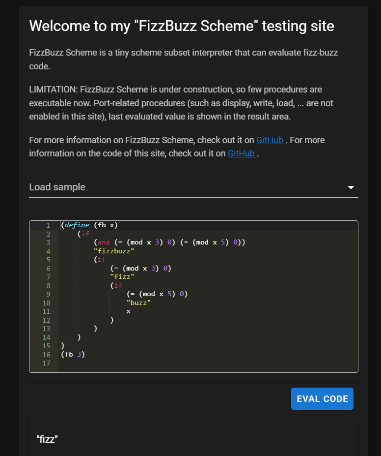

# fbs-web

A web interface for [FizzBuzz Scheme](https://github.com/hrkt/fizzbuzz-scheme)

> FizzBuzz Scheme : A tiny scheme subset interpreter that can evaluate fizz-buzz code.



## How-to

### install

```bash
$ npm install
```

### run dev server

```bash
$ npm run dev
```

### build contents for the static site

```bash
$ npm run generate
```


## Requirements

- Node 14 or later
- npm 7 or later
- Modern browsers

## Powered by

- [Nuxt](https://nuxtjs.org/) with [Vuetify](https://vuetifyjs.com/)
- [Ace](https://ace.c9.io/)

## License

MIT
